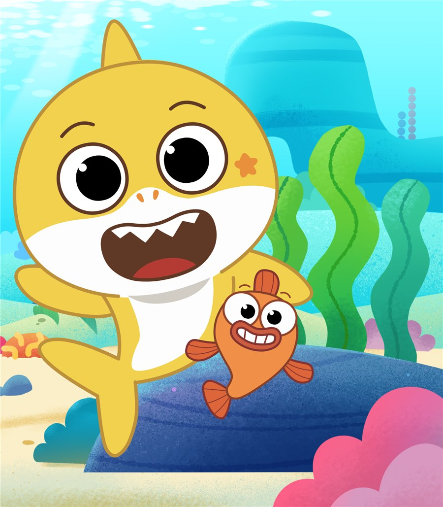
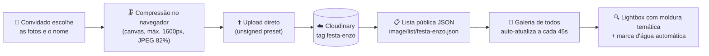
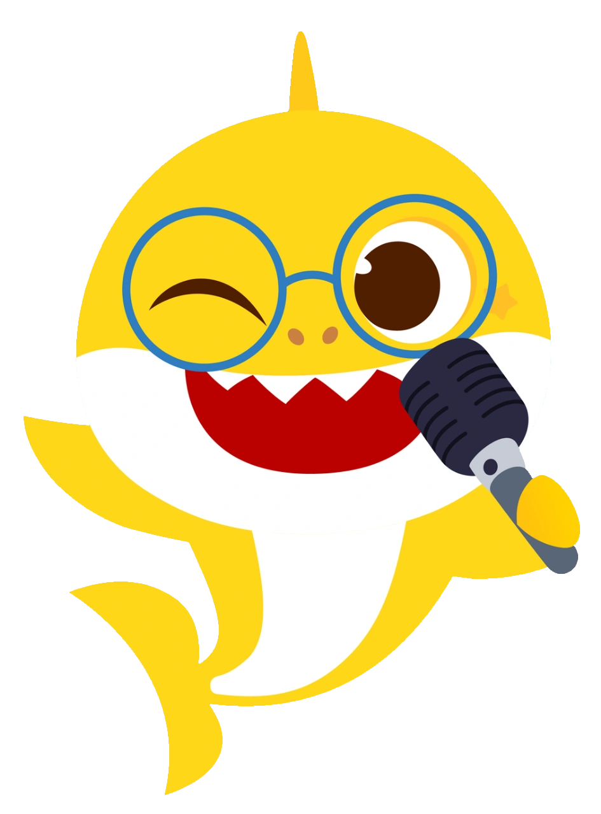

<div align="center">

# 🦈 Enzo faz 3! — Festa Baby Shark 🌊

**Convite-cardápio interativo + galeria de fotos colaborativa para a festa de 3 anos do Enzo**

*Doo doo doo doo doo doo!* 🎶

[](https://euroberto-br.github.io/festa-enzo/)
[](#)
[](#)
[](#)
[](#)
[](#)



**Zero frameworks · Zero build · Zero backend próprio** — só HTML, CSS e JavaScript vanilla.

</div>

---

## 📖 Sobre o projeto

Um site-experiência com o tema **Baby Shark's Big Show** que transforma o cardápio da festa em um
**mergulho no oceano**: o convidado começa na superfície do mar e vai descendo — de **0 m até −40 m** —
passando por cada categoria de comida, cada uma apresentada por um personagem da família tubarão,
até chegar ao bolo e ao fundo do mar. No caminho há peixinhos escondidos para caçar, música,
confete e uma salinha com 4 mini-jogos.

O site tem duas páginas:

| Página | O que faz |
|---|---|
| 🍽️ [`index.html`](index.html) | O convite-cardápio interativo (o "mergulho") |
| 📸 [`fotos.html`](fotos.html) | Galeria colaborativa — os convidados enviam fotos da festa pelo celular e todo mundo vê |

---

## ✨ Funcionalidades

### 🍽️ O cardápio-mergulho (`index.html`)

O cardápio é dividido em **14 estações de profundidade**, cada uma com um "anfitrião" da família tubarão
(com fotos reais da família em bolhas de vidro) e um prato ilustrado em SVG desenhado à mão:

| Profundidade | Seção | Anfitrião |
|---:|---|---|
| −2 m | 🥟 Entrada | William, o peixe-piloto |
| −5 m | 🍗 Salgados *(23 variedades!)* | Papai Tubarão |
| −8 m | 🍤 Finger Foods | Mamãe Tubarão |
| −11 m | 🍔 Lanchonete | Baby Shark |
| −14 m | 🧺 Pic-nic Kids | Baby Shark no microfone |
| −17 m | 🥗 Salada | Vovô Tubarão |
| −20 m | 🍝 Prato Quente | Mamãe Tubarão |
| −24 m | 🍨 Sobremesas | Vovó Tubarão |
| −28 m | 🍬 Docinhos *(10 sabores)* | Vovó Tubarão |
| −32 m | 🥤 Bebidas | Família: go, go, go! |
| −34 m | 🍺 Papais *(área 18+, card escuro)* | Papai Tubarão |
| −38 m | 🎂 **O Bolo** *(sabor Belga — gran finale)* | O aniversariante! |
| −40 m | ☕ Encerramento | Família reunida |
| Bônus | 🎮 Salinha de jogos | Baby Shark |

**Detalhes que dão vida à página:**

- 🫧 **Ambiente oceânico** — bolhas sobem continuamente pelo fundo, raios de luz atravessam a água e o
  gradiente do fundo escurece conforme você desce (céu → água rasa → oceano → profundo);
- 🏊 **Trilha de mergulho** *(telas grandes)* — um Baby Shark fixo na lateral desce acompanhando o scroll
  e mostra a profundidade atual em metros;
- 🎴 **Cartões com relevo "de plástico"** — sombras internas e bordas espessas imitam brinquedo, revelados
  um a um com `IntersectionObserver` conforme entram na tela;
- 🐟 **Caça aos 7 peixinhos** — peixinhos escondidos pelos cards; cada captura solta confete e o placar
  fica salvo em `localStorage` (com botão de recomeçar). Achou todos? Chuva de confete! 🎉
- 🎵 **Botão de música** — toca o `baby-shark.mp3` em loop; se o arquivo falhar, um **fallback sintetiza a
  melodia do Baby Shark em tempo real com a Web Audio API** (osciladores, nota por nota!);
- 🦈 **Personagens que reagem** — toque em qualquer personagem e ele sacode com um "squeak" sintetizado;
- 🎂 **Festa no bolo** — ao chegar na seção do bolo, as 3 velinhas se acendem sozinhas e explode confete
  (partículas desenhadas em `<canvas>` com física própria: gravidade, rotação e fade).

### 🎮 A salinha de jogos (4 mini-jogos)

| Jogo | Como joga |
|---|---|
| 🦈 **Alimente o Baby Shark** | Toque nas comidinhas flutuantes — elas voam até a boca do tubarão (*nhac!*) |
| 🫧 **Estoura Bolhas** | Bolhas sobem pelo aquário; ~1 em cada 4 esconde uma surpresa 🎁 |
| 🃏 **Memória da Família** | Jogo da memória com as fotos do Papai, da Mamãe e do Baby Shark (3 pares) |
| 🐠 **Corrida do Cardume** | Arraste o dedo e o Baby Shark nada atrás, colecionando amigos peixes |

- Metas progressivas (**5 → 10 → 20 → 35 → 50 pontos**) com fanfarra e confete a cada conquista;
- Placar e HUD por jogo, dicas contextuais;
- Os jogos **pausam automaticamente** quando saem da tela (`IntersectionObserver`) — nada de gastar bateria à toa;
- Sons de *nhac*, *pop* e fanfarra 100% sintetizados com Web Audio (sem arquivos de áudio extras).

### 📸 A galeria colaborativa (`fotos.html`)

Os convidados enviam fotos **direto do celular, sem instalar nada e sem criar conta** — e elas aparecem
na galeria de todo mundo em segundos:



**Como funciona por dentro:**

- ☁️ **Sem servidor próprio** — o upload vai do navegador direto para o Cloudinary via *unsigned upload
  preset*; só valores públicos ficam no código (nenhuma chave secreta);
- 🗜️ **Compressão no aparelho** — a foto é redimensionada num `<canvas>` antes de subir (só usa a versão
  comprimida se ela realmente ficar menor);
- ✍️ **Autoria** — o nome do convidado vai como *caption* da foto e aparece na galeria ("📷 Tia Ana");
  o nome fica lembrado no aparelho (`localStorage`);
- 📊 **Fila de envio** — cada foto tem barra de progresso real (`XMLHttpRequest.upload.onprogress`),
  estado de sucesso/erro e some sozinha da fila;
- ⚡ **Aparece na hora** — a foto recém-enviada entra na galeria imediatamente (merge local por 2 min,
  até o cache da listagem do Cloudinary refletir o envio);
- 🔄 **Sempre fresca** — a galeria se atualiza a cada 45 s, ao voltar para a aba (`visibilitychange`)
  e no botão "↺ Atualizar", com *cache-buster* de 30 s;
- 🖼️ **Thumbs otimizadas** — miniaturas `420×420` com `c_fill`, `g_auto`, `q_auto`, `f_auto` (o Cloudinary
  entrega WebP/AVIF conforme o navegador);
- 🎨 **Lightbox com 5 molduras temáticas** — cada foto "sorteia" sua moldura (oceano, coral rosa, sol,
  alga verde ou mar profundo) por *hash* do `public_id` — **estável**: a mesma foto sempre ganha a mesma
  moldura, com mascote espiando por cima e decorações combinando;
- 👆 **Navegação completa** — setas, teclado (`←` `→` `Esc`) e *swipe* no celular;
- 💧 **Proteção das fotos** — a versão ampliada recebe **marca d'água automática** aplicada pelo próprio
  Cloudinary ("Festa do Enzo - 3 anos (2026)"), além de camada-escudo sobre a imagem, bloqueio de
  clique-direito/arrastar e `-webkit-touch-callout: none` (sem popup de salvar no toque longo do iOS).

---

## 🎨 Design system

Todo o visual nasce de **tokens CSS** (`:root`) inspirados no mundo do *Baby Shark's Big Show*:

| Cor | Token | Hex | Uso |
|:---:|---|---|---|
|  | `--ceu` | `#C9F3FF` | Céu / superfície |
|  | `--agua-rasa` | `#7FE0F5` | Água rasa |
|  | `--agua-media` | `#1D93CE` | Água média / tema |
|  | `--profundo` | `#083F76` | Fundo do mar |
|  | `--navy` | `#0D3B66` | Texto / bordas |
|  | `--amarelo` | `#FFD23F` | CTAs / destaque |
|  | `--laranja` | `#F49B33` | Acentos quentes |
|  | `--rosa` | `#F26DB3` | Fotos / carinho |
|  | `--verde` | `#58C472` | Jogos / sucesso |
|  | `--vermelho` | `#E8564A` | Erros / acentos |

- **Tipografia:** [Baloo 2](https://fonts.google.com/specimen/Baloo+2) (títulos arredondados, cara de
  desenho animado) + [Nunito](https://fonts.google.com/specimen/Nunito) (texto), via Google Fonts;
- **Linguagem visual "brinquedo de plástico":** cada superfície tem brilho em cima (`inset` claro),
  espessura embaixo (sombra dura colorida) e sombra ambiente — tudo só com `box-shadow`;
- **Ilustrações:** pratos, peixinhos, ondas e o cenário do fundo do mar são **SVGs desenhados à mão**
  direto no HTML (nenhuma imagem externa para os ícones);
- **Cada seção tem cor própria** via variável `--acento`, que tinge borda, tags, chips e sombras do card.

---

## ♿ Acessibilidade

| Recurso | Implementação |
|---|---|
| 🎬 Movimento reduzido | `prefers-reduced-motion` desliga **todas** as animações, bolhas e confete |
| ⌨️ Teclado | `:focus-visible` em todos os interativos; lightbox navega com `←` `→` `Esc` |
| 🔊 Leitores de tela | `aria-label` nos peixinhos/jogos/botões, `aria-live` no placar e na fila de upload, `role="dialog"` + `aria-modal` no lightbox, `role="tablist"` nas abas de jogos |
| 🖼️ Imagens | `alt` descritivo em todas as fotos; decorações marcadas com `aria-hidden` |
| 📱 Toque | Alvos grandes, `touch-action` ajustado por jogo, *swipe* no lightbox |

---

## 🔒 Privacidade

- As páginas usam `<meta name="robots" content="noindex, nofollow">` — **o site não aparece no Google**;
- O [`robots.txt`](robots.txt) **libera** o crawl de propósito: bloquear impediria o Google de ler a
  meta tag `noindex` (esse é o jeito certo de não indexar);
- Fotos ampliadas saem com marca d'água automática e a galeria dificulta download casual
  (clique-direito, arrastar e toque longo bloqueados nas fotos).

---

## 🗂️ Estrutura do projeto

```
festa/
├── index.html          # Convite-cardápio interativo (página principal)
├── fotos.html          # Galeria colaborativa de fotos (Cloudinary)
├── robots.txt          # Crawl liberado p/ o Google ler o noindex
├── img/                # Fotos da família + personagens Baby Shark
│   ├── hero-baby.jpg   #   imagem principal do hero
│   ├── enzo.jpeg       #   o aniversariante 🎉
│   ├── babyshark.png, brooklyn2.png, william.png, familia-go.png ...
│   └── papai/mamae/vovo/vovoa ...  (anfitriões das seções)
└── musica/
    └── baby-shark.mp3  # A música (com fallback sintetizado em Web Audio)
```

> 💡 **Sem dependências:** não há `package.json`, bundler nem framework. Cada página é um único
> arquivo HTML com CSS e JS embutidos — é só abrir no navegador.

---

## ☁️ Configuração do Cloudinary

A galeria usa apenas **valores públicos** (seguros de expor em site estático):

| Configuração | Valor | Onde fica |
|---|---|---|
| Cloud name | `znbneca7` | `fotos.html` |
| Upload preset | `festa_enzo` (*unsigned*) | Cloudinary → Settings → Upload |
| Tag das fotos | `festa-enzo` | aplicada pelo preset |
| Listagem pública | `Resource list` **habilitado** | Cloudinary → Settings → Security |

Fluxo de URLs:

```text
Upload:   POST https://api.cloudinary.com/v1_1/znbneca7/image/upload
Listagem: GET  https://res.cloudinary.com/znbneca7/image/list/festa-enzo.json
Thumb:    .../image/upload/c_fill,w_420,h_420,g_auto,q_auto,f_auto/v<versão>/<id>.jpg
Ampliada: .../image/upload/c_limit,w_1600,h_1600,q_auto,f_auto/<marca-d'água>/v<versão>/<id>.jpg
```

> ⚠️ A marca d'água é um *text overlay* do próprio Cloudinary — **não use emoji** no texto do overlay
> (causa erro 400).

---

## 🧪 Modos de teste (parâmetros de URL)

Atalhos usados durante o desenvolvimento (e úteis para tirar prints):

| URL | Efeito |
|---|---|
| `index.html?fotos` | Desliga todas as animações (página estática, ideal para screenshots) |
| `index.html?fotos&sojogos` | Mostra apenas a salinha de jogos |
| `index.html?fotos&rolagem=1200` | Abre a página já rolada 1200 px |
| `index.html?jogo=bolhas` | Abre com um jogo específico ativo (`comilanca` · `bolhas` · `memoria` · `corrida`) |

---

## 🚀 Como rodar e publicar

**Rodar localmente:** basta abrir `index.html` no navegador — não precisa de servidor.
*(Para a galeria carregar a listagem do Cloudinary, prefira um servidor local:
`python -m http.server` e acesse `http://localhost:8000`.)*

**Publicar:** o site está no **GitHub Pages**, servido direto da branch `main`:

```bash
git add .
git commit -m "minha alteração"
git push origin main        # ✅ publica em https://euroberto-br.github.io/festa-enzo/
```

---

<div align="center">

### 🦈 Doo doo doo doo doo doo! 🎶

Feito com 💛 para o **Enzo** — 3 anos · 2026



</div>
